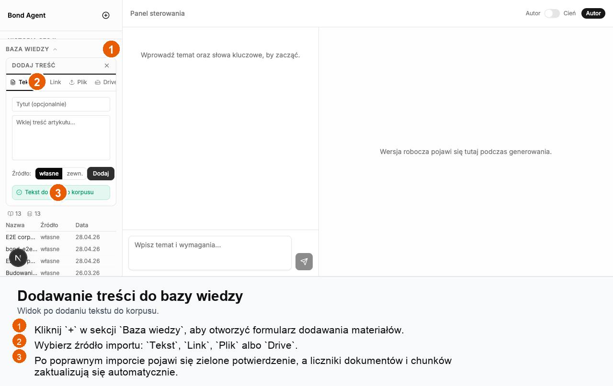
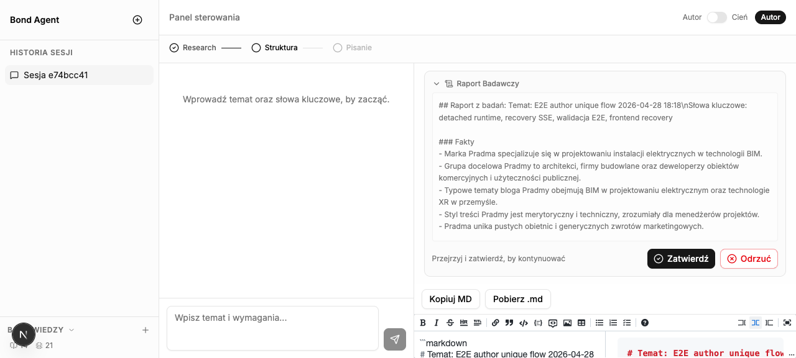
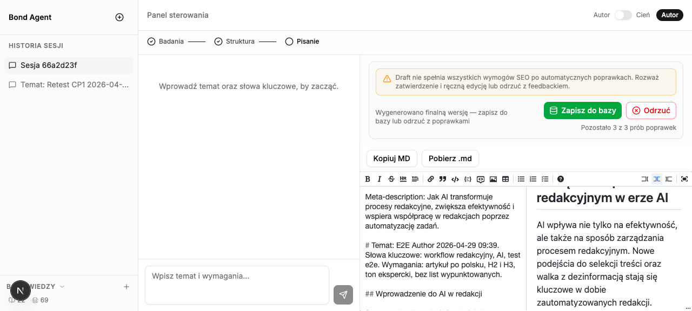
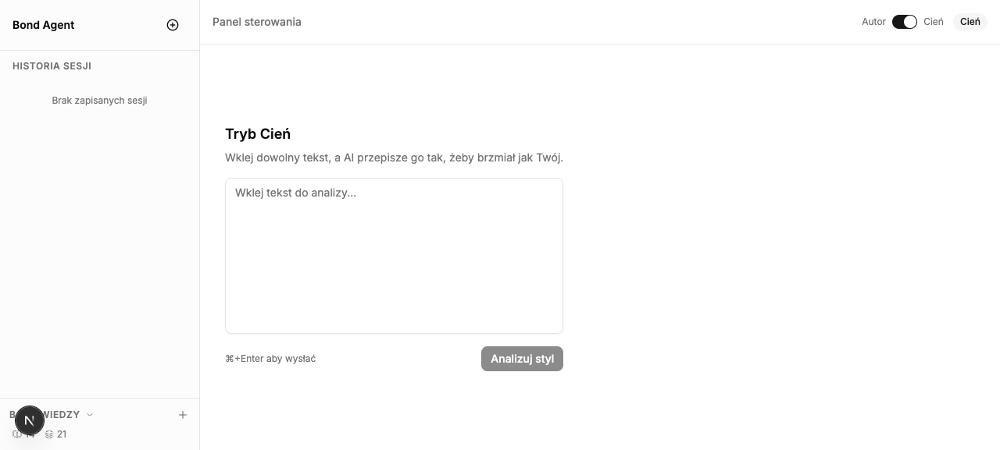
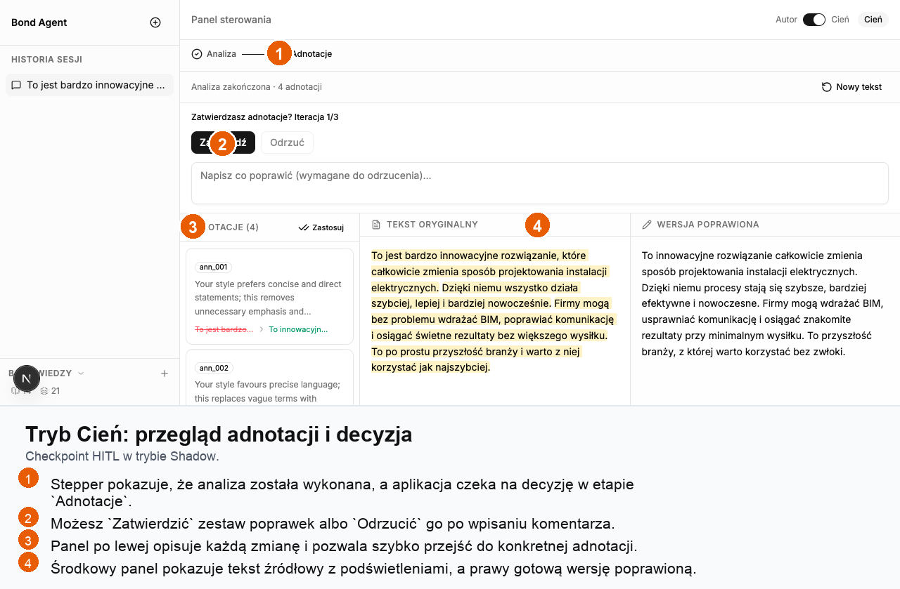
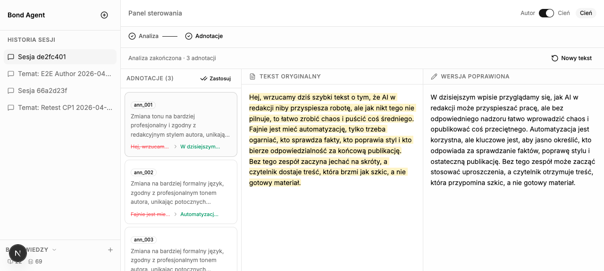

# Bond — Agent Redakcyjny

Agent AI wspomagający pracę redakcyjną, który buduje przeszukiwalny korpus z wielu źródeł treści i przeprowadza pełen pipeline badań oraz pisania artykułów z punktami zatwierdzenia przez człowieka (HITL).

## Opis

Bond składa się z dwóch głównych warstw:

**Korpus stylistyczny** — pobiera artykuły z czystego tekstu, plików (PDF, DOCX), adresów URL oraz folderów Google Drive. Treści są dzielone na fragmenty, osadzane przy użyciu `sentence-transformers` i przechowywane w ChromaDB do semantycznego wyszukiwania.

**Tryb Autora** — pipeline oparty na LangGraph, który na podstawie tematu i słów kluczowych przeprowadza badania webowe (Exa), proponuje strukturę artykułu (H1/H2/H3), generuje szkic zgodny z SEO z wstrzykniętymi fragmentami stylistycznymi RAG, a następnie zapisuje zatwierdzone metadane. Na etapach struktury i szkicu wymagane jest zatwierdzenie przez człowieka.

## Wymagania

- Python 3.11+
- [uv](https://github.com/astral-sh/uv)

## Instalacja

```bash
uv sync
```

Skopiuj `.env.example` do `.env` i dostosuj według potrzeb (patrz [Konfiguracja](#konfiguracja)).

Aby korzystać z importu z Google Drive, umieść plik `credentials.json` w głównym katalogu projektu (OAuth2 lub konto serwisowe).

Jeśli repo zostało przeniesione do innego katalogu i entrypointy w `.venv/bin/` wskazują na starą ścieżkę, odśwież środowisko:

```bash
uv sync --reinstall
```

W ostateczności usuń `.venv/` i uruchom `uv sync` ponownie.

## Uruchamianie

**Serwer API (korpus):**

```bash
uv run uvicorn bond.api.main:app --reload
```

API dostępne pod adresem `http://localhost:8000`. Interaktywna dokumentacja pod `http://localhost:8000/docs`.

**Tryb Autora — CLI (harness):**

```bash
uv run python -m bond.harness
```

Uruchamia interaktywny pipeline Trybu Autora w terminalu: podaj temat i słowa kluczowe, a następnie zatwierdzaj lub odrzucaj kolejne etapy (struktura, szkic).

**Live walidacja Exa dla polskich zapytań researchowych:**

```bash
uv run python scripts/validate_exa_polish.py
```

Skrypt zapisuje artefakty `summary.json` i `summary.md` w `.planning/artifacts/exa-polish-<timestamp>/`.

## API

### Stan serwera

| Metoda | Ścieżka | Opis |
|--------|---------|------|
| GET | `/health` | Sprawdzenie stanu serwera |

### Korpus

| Metoda | Ścieżka | Opis |
|--------|---------|------|
| POST | `/api/corpus/ingest/text` | Importuj czysty tekst |
| POST | `/api/corpus/ingest/file` | Importuj plik (PDF, DOCX, TXT) |
| POST | `/api/corpus/ingest/url` | Pobierz i importuj blog/URL |
| POST | `/api/corpus/ingest/drive` | Importuj folder Google Drive |
| GET | `/api/corpus/status` | Liczba artykułów i fragmentów |
| GET | `/api/corpus/smoke-test` | Wykonaj test wyszukiwania |

Wszystkie endpointy importu przyjmują pole `source_type`: `"own"` dla własnych treści, `"external"` dla materiałów referencyjnych zewnętrznych.

`POST /api/corpus/ingest/url` akceptuje tylko adresy `http` / `https`, ktore rozwiazuja sie do publicznych adresow sieciowych. Adresy loopback, prywatne, link-local, multicast, reserved oraz URL-e z osadzonymi credentials sa odrzucane z bledem `422`.

## Konfiguracja

Ustawienia są wczytywane z pliku `.env` (wszystkie opcjonalne — pokazano wartości domyślne):

### Korpus

| Zmienna | Domyślna | Opis |
|---------|----------|------|
| `CHROMA_PATH` | `./data/chroma` | Ścieżka do przechowywania ChromaDB |
| `ARTICLE_DB_PATH` | `./data/articles.db` | Dziennik artykułów SQLite |
| `LOW_CORPUS_THRESHOLD` | `10` | Ostrzeżenie gdy korpus ma mniej artykułów niż ta wartość |
| `RAG_TOP_K` | `5` | Liczba fragmentów zwracanych przy każdym wyszukiwaniu |
| `MAX_BLOG_POSTS` | `50` | Maksymalna liczba postów pobieranych przy imporcie z URL |
| `ALLOW_PRIVATE_URL_INGEST` | `false` | Dopuszcza ingest URL-i do adresow niepublicznych; domyslnie wylaczone i zalecane tylko do lokalnego debugowania |
| `GOOGLE_AUTH_METHOD` | `oauth` | `oauth` lub `service_account` |
| `GOOGLE_CREDENTIALS_PATH` | `./credentials.json` | Ścieżka do pliku poświadczeń Google |

### Tryb Autora

Wymagany klucz API (musi być ustawiony w `.env`):

| Zmienna | Opis |
|---------|------|
| `OPENAI_API_KEY` | Klucz OpenAI — używany przez węzły researcher i writer |

Exa nie wymaga osobnej zmiennej środowiskowej aplikacji. `researcher_node` łączy się bezpośrednio z `https://mcp.exa.ai/mcp`, więc potrzebny jest tylko outbound HTTPS z hosta uruchomieniowego.

Opcjonalne ustawienia (pokazano wartości domyślne):

| Zmienna | Domyślna | Opis |
|---------|----------|------|
| `CHECKPOINT_DB_PATH` | `./data/bond_checkpoints.db` | Baza danych checkpointów LangGraph (SqliteSaver) |
| `METADATA_DB_PATH` | `./data/bond_metadata.db` | Dziennik metadanych zatwierdzonych artykułów |
| `RESEARCH_MODEL` | `gpt-4o-mini` | Model LLM używany przez węzeł badań |
| `DRAFT_MODEL` | `gpt-4o` | Model LLM używany przez węzeł pisania |
| `MIN_WORD_COUNT` | `800` | Minimalna liczba słów w wygenerowanym szkicu |
| `DUPLICATE_THRESHOLD` | `0.85` | Próg podobieństwa cosinusowego przy wykrywaniu duplikatów |

### Trwalosc metadanych

Po zatwierdzeniu artykulu Bond zapisuje metadane najpierw do SQLite, a potem indeksuje temat w kolekcji metadanych ChromaDB. To nie jest rozproszony commit 2PC: jezeli zapis do Chroma nie powiedzie sie, aplikacja wykonuje kompensacje i usuwa wlasnie dodany rekord SQLite, po czym zwraca blad zamiast zostawiac niespójny stan.

## Szybki start dla nowych deweloperów

```bash
# 1. Zainstaluj zależności
uv sync

# 2. Skopiuj konfigurację i uzupełnij klucze API
cp .env.example .env
# Edytuj .env — ustaw OPENAI_API_KEY

# 3. Zainicjalizuj bazy danych i ChromaDB (jednorazowo)
uv run python setup_db.py

# 4. Uruchom backend
uv run uvicorn bond.api.main:app --reload

# 5. Uruchom frontend (w nowym terminalu)
cd frontend && npm install && npm run dev
```

Backend dostępny pod `http://localhost:8000/docs`, frontend pod `http://localhost:3000`.

> **Reset danych:** `uv run python setup_db.py --reset` (usuwa wszystkie bazy i ChromaDB — żąda potwierdzenia).

---

## Wdrożenie wewnętrzne (Docker Compose)

Wspierany shape wdrożeniowy to:

- publiczny frontend Next.js na porcie `3000`
- backend FastAPI wystawiony tylko na loopback hosta (`127.0.0.1:8000`) i dodatkowo chroniony trusted headerem proxy
- ChromaDB dostępne wyłącznie wewnątrz sieci Compose

### Wymagane zmienne środowiskowe

Poza standardowym `OPENAI_API_KEY` ustaw w `.env`:

- `INTERNAL_PROXY_TOKEN` — współdzielony sekret między frontendowym proxy i backendem
- `INTERNAL_BASIC_AUTH_USERNAME`
- `INTERNAL_BASIC_AUTH_PASSWORD`

W `docker-compose.internal.yml` auth jest wymuszony przez `INTERNAL_AUTH_ENABLED=true`, więc brak powyższych sekretów kończy się fail-closed zamiast cichego otwarcia aplikacji.

### Start profilu internal

```bash
docker compose -f docker-compose.yml -f docker-compose.internal.yml up --build
```

Publiczne i probe'owalne surface'y:

- UI: `http://localhost:3000/`
- frontend probe: `http://localhost:3000/healthz`
- backend readiness/liveness z hosta: `http://127.0.0.1:8000/health`, `http://127.0.0.1:8000/health/live`, `http://127.0.0.1:8000/health/ready`

Chronione surface'y:

- wszystkie route'y aplikacji poza `/_next/*`, metadanymi statycznymi, `favicon.ico` i `/healthz` wymagają Basic Auth na froncie
- backendowe `/api/*` oraz inne nie-health route'y zwracają `401`, jeśli ominiesz frontend i nie dostarczysz `X-Bond-Internal-Proxy-Token`

### Dev vs internal

Lokalny development i deployment wewnętrzny nie są tym samym flow:

- w dev uruchamiasz `uvicorn --reload` oraz `next dev`; frontend rozmawia z backendem bezpośrednio przez `http://localhost:8000`, żeby nie wpadać w buffering/problemy SSE po stronie dev proxy
- w profilu internal frontend działa jako produkcyjny `standalone`, a cały ruch przeglądarki do `/api/*` idzie same-origin przez gateway Basic Auth oraz node'owy route handler proxy z trusted headerem do backendu; ten shape zachowuje poprawnie `JSON`, `SSE` i `FormData` bez problemów z bufferingiem w `standalone`

### Lokalny smoke test `standalone`

`next build` nie kopiuje `public/` ani `.next/static/` do `.next/standalone` automatycznie. Jeśli chcesz lokalnie uruchomić dokładnie ten sam runtime co w obrazie kontenerowym, wykonaj:

```bash
cd frontend
npm run build
rm -rf .next/standalone/public .next/standalone/.next/static
mkdir -p .next/standalone/.next
cp -R public .next/standalone/public
cp -R .next/static .next/standalone/.next/static
PORT=3000 HOSTNAME=0.0.0.0 node .next/standalone/server.js
```

Pominięcie kopiowania assetów kończy się `404` dla `/_next/static/*` i brakiem hydratacji UI.

Na tym samym shape wdrożeniowym zostały też potwierdzone pełne przepływy HITL przez publiczny frontend z Basic Auth: świeży Author doszedł do `completed` po `checkpoint_1`, `low_corpus` i `checkpoint_2`, a świeży Shadow po `shadow_checkpoint`.

---

## Jak korzystać z aplikacji

Ta sekcja uzupełnia wcześniejsze części `Instalacja`, `Uruchamianie` i `Konfiguracja`. Jeśli chcesz przejść od zera do pierwszego użycia interfejsu, wykonaj poniższy workflow.

### 1. Przygotowanie środowiska

1. Zainstaluj zależności backendu i frontendu:

```bash
uv sync
cp .env.example .env
cd frontend && npm install
```

2. Uzupełnij plik `.env`:
   `OPENAI_API_KEY` jest wymagany do trybów `Autor` i `Cień`.
   `GOOGLE_AUTH_METHOD` i `GOOGLE_CREDENTIALS_PATH` ustaw tylko wtedy, gdy chcesz importować treści z Google Drive.

3. Przy pierwszym uruchomieniu przygotuj lokalne bazy danych i cache modelu:

```bash
uv run python setup_db.py
```

4. Uruchom aplikację lokalnie:

```bash
# terminal 1
uv run uvicorn bond.api.main:app --reload --port 8000

# terminal 2
cd frontend && npm run dev
```

5. Otwórz `http://localhost:3000`.
   Dokumentacja API jest dostępna pod `http://localhost:8000/docs`.

6. Jeśli wolisz uruchomienie kontenerowe zamiast lokalnego setupu, użyj:

```bash
docker compose up --build
```

### 2. Dodanie materiałów do bazy wiedzy

Tryb `Autor` działa najlepiej wtedy, gdy korpus zawiera kilka własnych tekstów. To one uczą Bonda stylu, tonu i preferowanej struktury artykułów.

1. Rozwiń sekcję `Baza wiedzy` w lewym dolnym rogu.
2. Kliknij `+`, aby otworzyć formularz dodawania treści.
3. Wybierz źródło importu:
   `Tekst` dla ręcznego wklejenia treści,
   `Link` dla publicznego adresu URL,
   `Plik` dla `PDF`, `DOCX` albo `TXT`,
   `Drive` dla folderu Google Drive.
4. Ustaw typ źródła:
   `własne` dla materiałów uczących stylu,
   `zewn.` dla materiałów referencyjnych i researchowych.
5. Po udanym imporcie sprawdź zielone potwierdzenie i wzrost liczników dokumentów oraz fragmentów.



### 3. Generowanie nowego szkicu w trybie `Autor`

Tryb `Autor` prowadzi przez pełen workflow: temat -> research -> propozycja struktury -> szkic -> decyzja człowieka.

1. Upewnij się, że w prawym górnym rogu aktywny jest tryb `Autor`.
2. Wpisz temat, słowa kluczowe i wymagania redakcyjne w polu wiadomości.

Przykładowy prompt:

```text
Temat: Jak BIM skraca czas projektowania instalacji elektrycznych
Słowa kluczowe: BIM, projektowanie instalacji, automatyzacja, efektywność
Wymagania: styl ekspercki, prosty język, konkretne przykłady, długość 900-1100 słów
```

3. Wyślij wiadomość i poczekaj, aż Bond przejdzie etap `Research`.
4. Na pierwszym checkpointcie przeczytaj raport badawczy i oceń zaproponowaną strukturę.
5. Kliknij `Zatwierdź`, aby przejść dalej, albo `Odrzuć`, aby wrócić z uwagami do kolejnej iteracji.



6. Po wygenerowaniu szkicu przejdziesz do drugiego checkpointu.
7. Przejrzyj treść w edytorze po prawej stronie.
8. Jeśli szkic jest gotowy, kliknij `Zapisz do bazy`.
9. Jeśli potrzebne są poprawki, kliknij `Odrzuć` i wpisz konkretne uwagi.
10. W każdej chwili możesz użyć `Kopiuj MD` albo `Pobierz .md`, aby wyeksportować wynik poza aplikację.



### 4. Poprawianie gotowego tekstu w trybie `Cień`

Tryb `Cień` służy do przepisywania istniejącej treści tak, aby lepiej pasowała do stylu autora lub marki.

1. Przełącz aplikację na tryb `Cień`.
2. Wklej tekst do analizy.
3. Kliknij `Analizuj styl` albo użyj skrótu `Cmd/Ctrl + Enter`.



4. Po analizie zobaczysz trzy główne obszary:
   listę adnotacji po lewej,
   tekst oryginalny z podświetleniami pośrodku,
   poprawioną wersję po prawej.
5. Klikaj adnotacje, aby szybko przechodzić do konkretnych zmian.
6. Jeśli poprawki są trafne, kliknij `Zatwierdź`.
7. Jeśli chcesz wymusić nową iterację, wpisz komentarz i kliknij `Odrzuć`.



8. Po zatwierdzeniu otrzymasz finalną wersję poprawionego tekstu, gotową do dalszej ręcznej edycji albo skopiowania.



### 5. Najczęstsze scenariusze użycia

1. Szybki draft nowego artykułu:
   dodaj kilka własnych materiałów do `Bazy wiedzy`, uruchom tryb `Autor` i przejdź przez dwa checkpointy HITL.

2. Ujednolicenie tonu istniejącego tekstu:
   wklej roboczą treść do trybu `Cień`, przejrzyj adnotacje i zaakceptuj wersję poprawioną.

3. Rozbudowa korpusu przed nową kampanią:
   zaimportuj wcześniejsze artykuły, briefy, PDF-y lub folder z Drive, a dopiero potem generuj nowe teksty.

4. Iteracyjna współpraca redakcyjna:
   odrzucaj strukturę lub szkic z konkretnym komentarzem zamiast poprawiać wszystko ręcznie poza aplikacją.

### 6. Dobre praktyki

1. Najlepsze wyniki w trybie `Autor` uzyskasz, gdy korpus zawiera kilka własnych tekstów, a nie tylko źródła zewnętrzne.
2. Przy odrzucaniu checkpointów dawaj konkretne uwagi, na przykład: `skrót wstępu`, `dodaj przykłady z rynku`, `mniej marketingowego tonu`.
3. Jeśli widzisz ostrzeżenie o niskim stanie korpusu, potraktuj je jako sygnał do dodania kolejnych materiałów przed generowaniem.
4. Panel `Historia sesji` po lewej stronie pozwala wracać do wcześniejszych przebiegów bez zaczynania od zera.
5. Przy lokalnym developmentcie korzystaj z `http://localhost:3000`, żeby uniknąć problemów z mieszaniem originów podczas debugowania SSE.

## Troubleshooting SSE

Strumień SSE (`/api/chat/stream`, `/api/chat/resume`) używa `text/event-stream`. Poniżej typowe problemy i rozwiązania.

### Eventy nie docierają / strumień "wisi"

**Proxy lub nginx buforuje odpowiedź.**

Backend wysyła nagłówek `X-Accel-Buffering: no` — wymagana konfiguracja nginx po stronie serwera:

```nginx
proxy_buffering off;
proxy_cache off;
proxy_read_timeout 300s;
```

Lokalnie (bez proxy) problem nie wystąpi. Na produkcji sprawdź logi nginx.

---

### `net::ERR_CONNECTION_REFUSED` przy starcie frontendu

Frontend próbuje połączyć się z `http://localhost:8000` — backend musi działać wcześniej.

```bash
# Sprawdź czy backend działa
curl http://localhost:8000/health
```

Jeśli zwraca błąd CORS (`blocked by CORS policy`), sprawdź zmienną `CORS_ORIGINS` w `.env`:

```
CORS_ORIGINS=["http://localhost:3000"]
```

---

### Strumień SSE przerywa się po ~30 sekundach

Niektóre proxy (nginx, Cloudflare) zamykają idle connections. Backend wysyła heartbeat co 5 sekund — event `{"type": "heartbeat", "data": "ping"}`. Frontend (`useStream.ts`) ignoruje heartbeat, ale rozróżnia teraz dwa przypadki:

- brak `Response` z `fetch()` — bezpieczny retry po stronie przeglądarki
- zerwanie po otrzymaniu `Response` — **brak replayu `POST`**, recovery idzie przez `GET /api/chat/history/{thread_id}`

Frontend normalizuje też browserowe separatory `CRLF` w strumieniu SSE i nie próbuje już traktować tokenów-numerycznych jako obiektów JSON, więc eventy z prawdziwego `ReadableStream` są konsumowane poprawnie również w Playwright/Chromium.

Po committed disconnect polling `/api/chat/history/{thread_id}` trwa do osiągnięcia trwałego stanu `paused`, `completed` albo `error`, więc dłuższy reload-recovery w Trybie Autora nie urywa się już po ~30 sekundach.

Jeśli mimo to połączenie pada, zwiększ timeout proxy:

```nginx
proxy_read_timeout 600s;
```

---

### Lokalny frontend działa pod `127.0.0.1:3000`, ale backend odrzuca CORS

Domyślnie lokalna konfiguracja zakłada frontend pod `http://localhost:3000`. Jeśli uruchamiasz lub testujesz UI pod `http://127.0.0.1:3000`, backend może odrzucić `POST /api/chat/stream` i `POST /api/chat/resume`.

Najprostsze rozwiązanie:

- używaj `http://localhost:3000`

albo dopisz origin do `CORS_ORIGINS` w `.env`, np.:

```env
CORS_ORIGINS=["http://localhost:3000","http://127.0.0.1:3000"]
```

To jest szczególnie ważne przy testach Playwright i ręcznym debugowaniu browserowego SSE.

---

### `hitl_pause` event nie dociera po zatrzymaniu grafu

Backend emituje `hitl_pause` **po** zakończeniu strumienia `astream_events` — nie w jego trakcie. Kolejność emisji jest zawsze:

```
data: {"type": "stage", ...}
data: {"type": "hitl_pause", ...}
```

Jeśli frontend nie odbiera tych eventów, sprawdź czy backend zwraca w historii sesji pola:

```json
{
  "session_status": "paused",
  "pending_node": "checkpoint_2",
  "can_resume": true
}
```

Frontend używa teraz tych pól do odtworzenia checkpointu bez ponownego wysyłania tej samej komendy `POST`.

W Shadow `thread_id` jest też zapisywany do `sessionStorage`, więc reload strony na `shadow_checkpoint` powinien odtworzyć adnotacje, poprawioną wersję i akcje `Zatwierdź / Odrzuć`.

---

### `POST /api/chat/resume` zwraca błąd "Poprzednia akcja HITL jest jeszcze w toku"

Backend używa per-thread locka (`asyncio.Lock`) — dwa kliknięcia "Zatwierdź" dla tego samego `thread_id` blokują się wzajemnie. Drugie żądanie jest odrzucane z tym komunikatem.

Aktualny frontend ogranicza ten problem na dwa sposoby:

- podczas aktywnego streamu blokuje kolejne akcje HITL
- po zerwaniu committed `resume` pokazuje banner recovery i pobiera stan z `/api/chat/history/{thread_id}`, zamiast replayować `POST /api/chat/resume`

Jeśli błąd nadal się pojawia, sprawdź w DevTools, czy użytkownik nie wysłał drugiego `resume` ręcznie albo czy nie działa niestandardowy reverse proxy cache.

Jeśli chcesz odtworzyć poprawne zachowanie lokalnie, najpewniejszy przebieg testowy to:

1. otwórz `http://localhost:3000/shadow`
2. doprowadź sesję do `shadow_checkpoint`
3. odśwież stronę i potwierdź, że checkpoint się odtworzył
4. kliknij `Zatwierdź`
5. zerwij połączenie po wysłaniu `resume`
6. potwierdź przez `GET /api/chat/history/{thread_id}`, że sesja jest `completed` albo wróciła do poprawnego stanu recovery bez replayu `POST /api/chat/resume`

Repo zawiera też gotowy harness przeglądarkowy dla pełnego rerunu Shadow + Author po detached runtime:

```bash
python3 scripts/playwright_detached_runtime_journey.py --frontend-url http://localhost:3000 --api-url http://localhost:8000
```

Wymaga lokalnie zainstalowanego Python Playwright.

---

### Checkpoint `low_corpus` zachowuje się inaczej niż pozostałe checkpointy

To już nie powinno występować. `low_corpus` używa tego samego kontraktu HITL co reszta pipeline'u:

```json
{
  "checkpoint": "low_corpus",
  "type": "approve_reject"
}
```

W UI pojawia się jako standardowy panel ostrzeżenia z akcjami kontynuacji lub przerwania.

---

### Brak modelu `paraphrase-multilingual-MiniLM-L12-v2` przy starcie

ChromaDB pobiera model z HuggingFace przy pierwszym uruchomieniu (ok. 500 MB). W środowisku bez internetu uruchom `setup_db.py` z dostępem do sieci wcześniej — model jest cache'owany lokalnie. W obrazie Dockera cache trafia do `/app/data/.cache`, więc przetrwa restart kontenera, o ile zachowasz volume `bond-data`.

```bash
uv run python setup_db.py  # pobiera i zapisuje model
```

---

### `KeyError: 'topic'` lub `KeyError: 'keywords'` w logach backendu

Graf LangGraph wymaga pól `topic` i `keywords` w stanie wejściowym. Endpoint `/api/chat/stream` ustawia je automatycznie z `req.message`. Jeśli wywołujesz API bezpośrednio, wymagana struktura:

```json
{
  "message": "Temat artykułu",
  "mode": "author"
}
```

---

### Logi SSE w przeglądarce (DevTools)

W Chrome/Firefox: **Network → filter: EventStream** → kliknij żądanie `/stream` lub `/resume` → zakładka **EventStream** pokazuje każdy event osobno.

---

## Programowanie

```bash
uv run pytest          # uruchom testy
uv run ruff check .    # sprawdź styl kodu
uv run ruff format .   # formatuj kod
```
